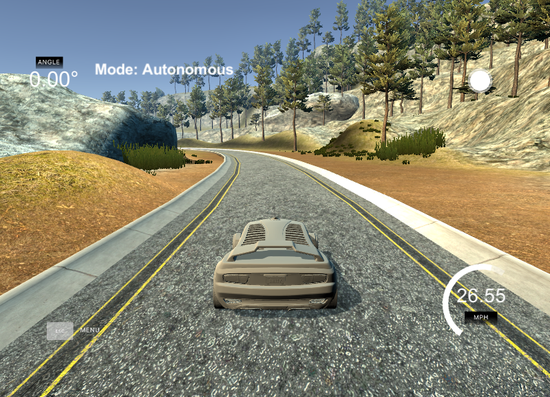

[//]: # (Image References)


[image1]: ./examples/training-624x291.png "Training Architecture"
[image2]: ./examples/inference-624x132.png "Inference Architecture"
[image3]: ./examples/preprocess.png "Preprocess Steps"
[image4]: ./examples/aug.png "Augmentation Data"
[image5]: ./examples/placeholder_small.png "Recovery Image"
[image6]: ./examples/placeholder_small.png "Normal Image"
[image7]: ./examples/placeholder_small.png "Flipped Image"


# **Behavioral Cloning** 

|Lake Track|
|:--------:|
|[](https://youtu.be/vBpUkWp4E_M)|
|[YouTube Link](https://youtu.be/vBpUkWp4E_M)|

---

**Behavioral Cloning Project**

The goals / steps of this project are the following:
* Use the simulator to collect data of good driving behavior
* Build, a convolution neural network in Keras that predicts steering angles from images
* Train and validate the model with a training and validation set
* Test that the model successfully drives around track one without leaving the road
* Summarize the results with a written report


---
### Files Submitted & Code Quality

#### 1. Submission files
My project includes the following files:
* `model.py` containing the script to create and train the model
* `drive.py` for driving the car in autonomous mode
* `utils.py` script for preprocess operations (i.e resize, augumentation)
* `model.h5` containing a trained convolution neural network 
* `writeup_report.md` summarizing the results

#### 2. Submission includes functional code
Using the Udacity provided simulator and my drive.py file, the car can be driven autonomously around the track by executing 
```sh
python drive.py model.h5
```

#### 3. Submission code

The model.py file contains the code for training and saving the convolution neural network. The file shows the pipeline I used for training and validating the model, and it contains comments to explain how the code works.

### Model Architecture and Training Strategy

#### 1. Model Architecture & Summary

The network is based on [The NVIDIA model](https://devblogs.nvidia.com/parallelforall/deep-learning-self-driving-cars/), which has been proven to work in this problem domain.
Only changes is the `dropout-layer`. 


![alt text][image1]

Figure shows a block diagram of our training system. Images are fed into a CNN that then computes a proposed steering command. The proposed command is compared to the desired command for that image, and the weights of the CNN are adjusted to bring the CNN output closer to the desired output. Here we are doing different preprocessing operations rather than "Random shift and rotation". We will explain preprocessing steps later.

![alt text][image2]

After training, the network is able to generate steering commands from the video images of a single center camera.


| Layer (type)                   |Output Shape      |Params  |Connected to     |
|--------------------------------|------------------|-------:|-----------------|
|lambda_1 (Lambda)               |(None, 66, 200, 3)|0       |lambda_input_1   |
|convolution2d_1                 |(None, 31, 98, 24)|1824    |lambda_1         |
|convolution2d_2                 |(None, 14, 47, 36)|21636   |convolution2d_1  |
|convolution2d_3                 |(None, 5, 22, 48) |43248   |convolution2d_2  |
|convolution2d_4                 |(None, 3, 20, 64) |27712   |convolution2d_3  |
|convolution2d_5                 |(None, 1, 18, 64) |36928   |convolution2d_4  |
|dropout_1 (Dropout)             |(None, 1, 18, 64) |0       |convolution2d_5  |
|flatten_1 (Flatten)             |(None, 1152)      |0       |dropout_1        |
|dense_1 (Dense)                 |(None, 100)       |115300  |flatten_1        |
|dense_2 (Dense)                 |(None, 50)        |5050    |dense_1          |
|dense_3 (Dense)                 |(None, 10)        |510     |dense_2          |
|dense_4 (Dense)                 |(None, 1)         |11      |dense_3          |
|                                |**Total params**  |252219  |                 |

#### 2. Attempts to reduce overfitting in the model

The model contains dropout layers in order to reduce overfitting (model.py lines 67). 
The model was trained and validated on different data sets to ensure that the model was not overfitting. We also use data augmentation to prevent overfitting.
The model was tested by running it through the simulator and ensuring that the vehicle could stay on the track.

#### 3. Model parameter tuning

The model used an adam optimizer, so the learning rate was not tuned manually (model.py line 84).

#### 4. Appropriate training data

Training data was chosen to keep the vehicle driving on the road. I used a combination of center lane driving, recovering from the left and right sides of the road and also collect data from the other map on simulator.
One important thing is if you collect only center images, when the car tends to going outside of the road probably don't know how to turn back to the center. To handle this problem we need to collect recovering data.
The approach i used here is only record data when the car is driving from the side of the road back toward the center line.

* Center driving
* Left-right side driving (smooth drving around lane lines.)
* Recovering from sides of the road
* Drive with keyboard and mause

When you drive with keyboard, most of the time steering angle can be zero. But if you drive with mause mostly steering angle have a value rather than zero.
I am not sure about that it is effects the result or not.

#### 5. Preprocessing & Augmentation

In utils.py include the preprocessing and data augmentation functions. We are feeding the model with image and corresponding steering angle.
These are the preprocessing steps:
* Cropping the image
* Resize the image
* Convert image from RGB to YUV format

We are using this function before training and inference.

![alt text][image3]

To getting more data and preventing from overfitting we are using data augmentation. We are applying different methods and use all of them to train the model.
These are the data that i am using for training.

* Default image after preprocessing
* Rotated image
* Flipped image
* Translated image
* Added random shadow and brightness image with flipping.

I used flipper for last one because the map mostly have left turning. To handle this problem, i added flipped images to have a balance.
You can add flipper to another step, i think it doesn't effect the result too much.

![alt text][image4]

## Outcome

The model can drive the course without bumping into the side ways.

- [YouTube Link for Result Video ](https://youtu.be/vBpUkWp4E_M)


## References
- NVIDIA model: https://devblogs.nvidia.com/parallelforall/deep-learning-self-driving-cars/
- naokishibuya/car-behavioral-cloning: https://github.com/naokishibuya/car-behavioral-cloning